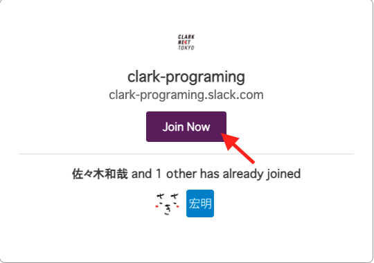
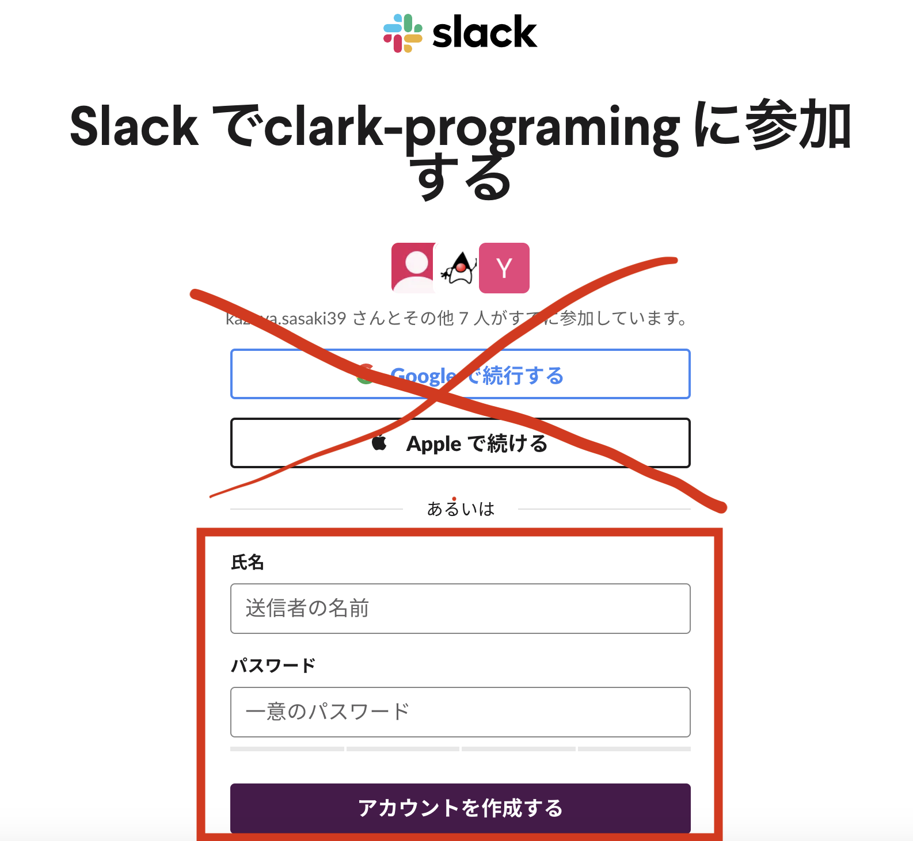
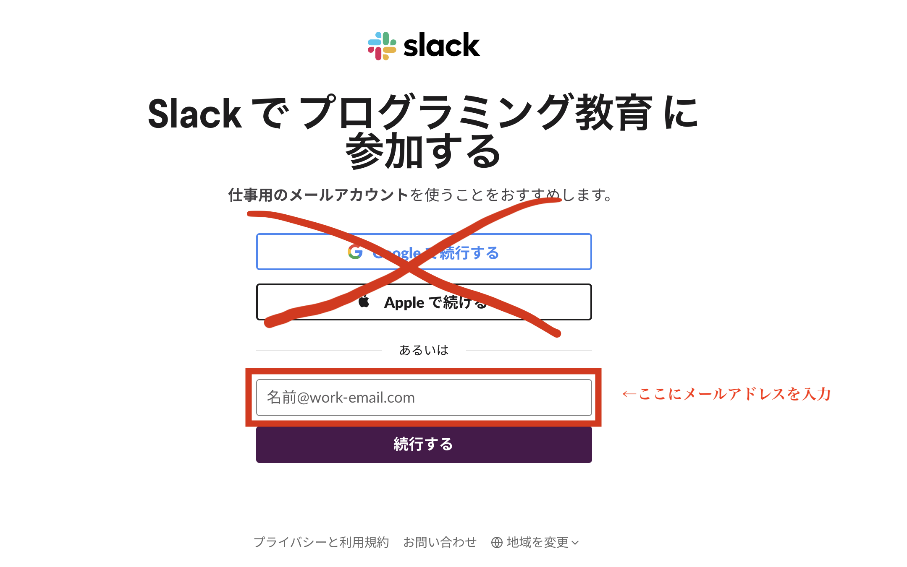
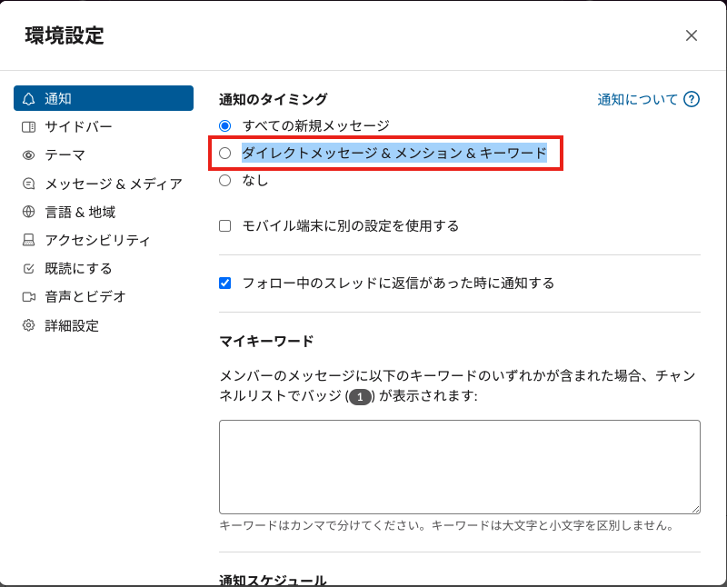
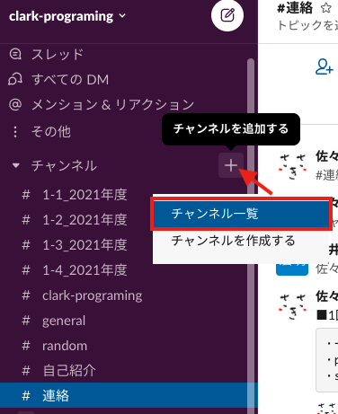
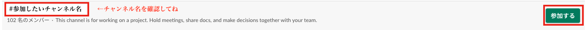

<link rel="stylesheet" href="https://stackpath.bootstrapcdn.com/bootstrap/4.4.1/css/bootstrap.min.css" integrity="sha384-Vkoo8x4CGsO3+Hhxv8T/Q5PaXtkKtu6ug5TOeNV6gBiFeWPGFN9MuhOf23Q9Ifjh" crossorigin="anonymous">

# 1. カリキュラムについて

<a data-toggle="collapse" href="#curriculum" aria-expanded="false" aria-controls="curriculum"> カリキュラム（一年間の流れ） </a>

    

        <iframe src="https://docs.google.com/presentation/d/e/2PACX-1vQHBu3W-Qh2nCDJi9eC-vRLT83q9YhO7CpLByOwyEBahqT3PlFQXErvjlTVAe0oT9_sPmxIqtcBEi7U/embed?start=true&loop=false&delayms=3000" frameborder="0" width="500" height="297" allowfullscreen="true" mozallowfullscreen="true" webkitallowfullscreen="true"></iframe>
    

# 2. Slackについて

<a data-toggle="collapse" href="#slackRegister" aria-expanded="false" aria-controls="slackRegister"> slackへの登録のやり方 </a>

    

        <ol>
            <li> <a href="https://slack.com/intl/ja-jp/downloads/windows" target="_blank">Slack Download for Windows</a>からslackアプリケーションをダウンロードし、インストールをする（<a href="https://slack.com/intl/ja-jp/help/articles/207691318-%E3%83%A2%E3%83%90%E3%82%A4%E3%83%AB%E7%89%88-Slack-%E3%82%92%E3%83%80%E3%82%A6%E3%83%B3%E3%83%AD%E3%83%BC%E3%83%89%E3%81%99%E3%82%8B" target="_blank">スマホアプリ</a>もあります）</li>
            <li> 招待状のメール or <a href="https://join.slack.com/t/clark-programing/shared_invite/zt-pkyw2cmc-4GFSjpdGeAsmGxC5RTQR3w" target="_blank">こちらのリンク</a>から clark-programingの招待ページへアクセス 
            ※招待メールが送られてきてない場合は、石井先生or佐々木先生に伝えてください。
             
            
招待メールの場合は、JoinNowをクリック

            
            </li>
            <li>
            アカウントを作成する。 
            アカウント作成時に、名前とパスワードが聞かれますので入力してください。 
            
             
            
もし、以下のような画面が出てきたら、メールアドレスを入力してください。

            
            </li>
        </ol>
    

<a data-toggle="collapse" href="#slackTodo" aria-expanded="false" aria-controls="slackTodo"> slackの登録できた人がやること </a>

    

        <ol>
            <li>Slackの通知の設定 
                <ul>
                    <li>右上の「clark-programing▼」を押す</li>
                    <li>環境設定（Prefarence)を押す</li>
                    <li>
                    「ダイレクトメッセージ&メンション&キーワード」を選択する 
                    
                    </li>
                </ul>
            </li>
            <li>チャンネルに参加 
                <ul>
                    <li>「チャンネル +」を押す</li>
                    <li>チャンネル一覧（Browse）を押す 
                    
                    </li>
                    <li>
                    以下のチャンネルの「参加する」を押す 
                        <ul>
                            <li>連絡</li>
                            <li>1-x_202X年度</li>
                        </ul>
                    
                    </li>
                </ul>
            </li>
            <li>
                自己紹介チャンネルに自己紹介を記載する 
                ※他の授業中に送ると他の生徒に通知が入ってしまうので、授業時間を避けて投稿してください。
            </li>
        </ol>
    

<a data-toggle="collapse" href="#slackRule" aria-expanded="false" aria-controls="slackRule"> slackの使い方とルール </a>

    

        <b>生徒間のDMは原則禁止です。</b> 
        SNS同様、slackの使い方にも情報モラルを持って使ってください。 
        slack内でのコミュニケーションにおいて校則に反した場合は、生徒指導の対象になりますので、充分注意して使ってください。 
    

# 3.Paizaラーニングについて

<a data-toggle="collapse" href="#paizaList" aria-expanded="false" aria-controls="paizaList"> paizaの学習順番 </a>

    

    <ol>
        <li>「<a href="https://paiza.jp/works/html/primer" target="_blank">HTML/CSS入門</a>」の全てのレッスン</li>
        <li>「<a href="https://paiza.jp/works/design/primer" target="_blank">Webデザイン入門</a>」一部のレッスン</li>
        <li>「<a href="https://paiza.jp/works/javascript/trial" target="_blank">Javascript体験</a>」の全てのレッスン</li>
        <li>「<a href="https://paiza.jp/works/js/primer" target="_blank">Javascript入門</a>」の全てのレッスン</li>
    </ol>
    

<a data-toggle="collapse" href="#howToQuestion" aria-expanded="false" aria-controls="howToQuestion"> 質問のやり方 </a>

    

        Comming Soon...
    

# 4.よくあるQ&A

<a data-toggle="collapse" href="#qa1" aria-expanded="false" aria-controls="qa1"> Q1)paizaのログインパスワードを忘れました </a>

    

        <ol>
            <li><a href="https://paiza.jp/password_resets" target="_blank">paizaのログインページへアクセス</a></li>
            <li>「パスワードを忘れた方はこちら」を押す</li>
            <li>「登録済みのメールアドレスを入力」し、「再設定メール送付」をする</li>
            <li>メールにログインをし、URLからパスワードを再設定する</li>
        </ol>
    

<a data-toggle="collapse" href="#qa2" aria-expanded="false" aria-controls="qa2"> Q2)paizaに登録したメールにログインできません。 </a>

    

        <ol>
            <li>中村先生もしくは石井先生に相談してください。</li>
        </ol>
    

<a data-toggle="collapse" href="#qa3" aria-expanded="false" aria-controls="qa3"> Q3)slackの招待メールが来ません。 </a>

    

        <ol>
            <li>
            石井先生か佐々木先生に相談してください。 
            もしくは、<a href="https://join.slack.com/t/clark-programing/shared_invite/zt-pkyw2cmc-4GFSjpdGeAsmGxC5RTQR3w" target="_blank">こちらのリンク</a>から招待メールなしで参加できます。
            </li>
        </ol>
    

<a data-toggle="collapse" href="#qa4" aria-expanded="false" aria-controls="qa4"> Q4)授業を休んだ時、どうすれば良いですか？ </a>

    

        
個別学習の時間に休んだ場合かつ進度が遅い場合は、家庭などで学習

    

<a data-toggle="collapse" href="#qa5" aria-expanded="false" aria-controls="qa5"> Q5)タイピングが苦手です。何か良い方法はありますか？また、どのくらいのタイピング能力があると良いですか？ </a>

    

        

        <a href="https://www.pken.com/tool/typing.html">P検タイピング</a>がおすすめです。

        

        こちらのサイトの「<b>日本語入力</b>」のゲームを<b>5分</b>設定で実施すると、P検○級レベルと出ます。 
        <b>3級レベルあると良い</b>かもです。<b>準2級レベルあれば十分</b>だと思います。
        

        

        タイピングは量をこなせば誰でも結果が出てくるので、基本ポジションを覚えて頑張りましょう！
        

    

<a data-toggle="collapse" href="#qa6" aria-expanded="false" aria-controls="qa6"> Q6)授業で実施するpaizaラーニングの講座以外の講座に興味があります。受講しても大丈夫ですか？ </a>

    

        
授業では、HTML/CSSとJavascript体験、Javascript入門を実施しますが、それ以外の言語は授業内では扱いません。

        
他の講座は、各々興味あるものを学習してもらって問題ありません。

        
プログラミング言語は似ているところがあるので、Javascriptで学んだことを他の言語で生かせたり、他の言語で学んだことをJavascriptでも生かせ流ことができるので、多角的に学習し、理解を深めることができます。

    

